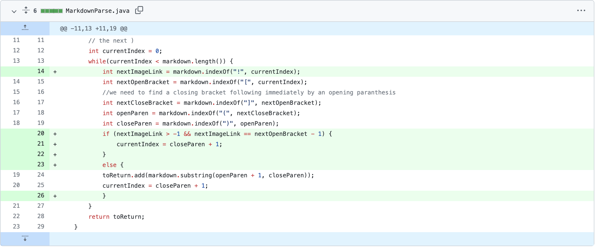
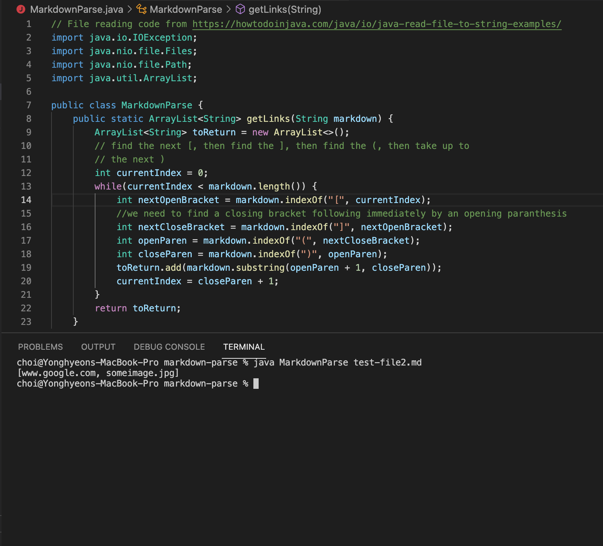
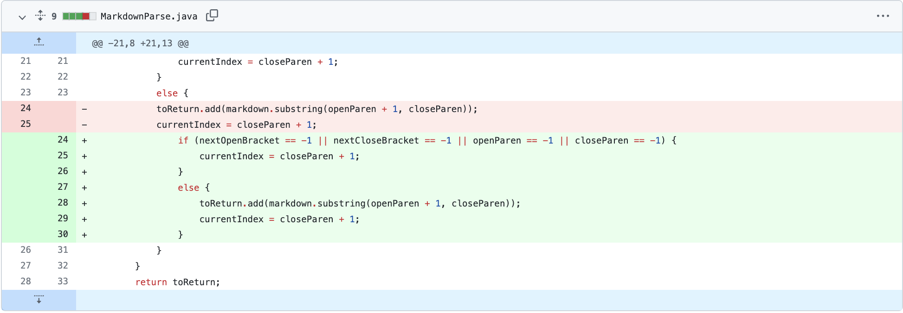
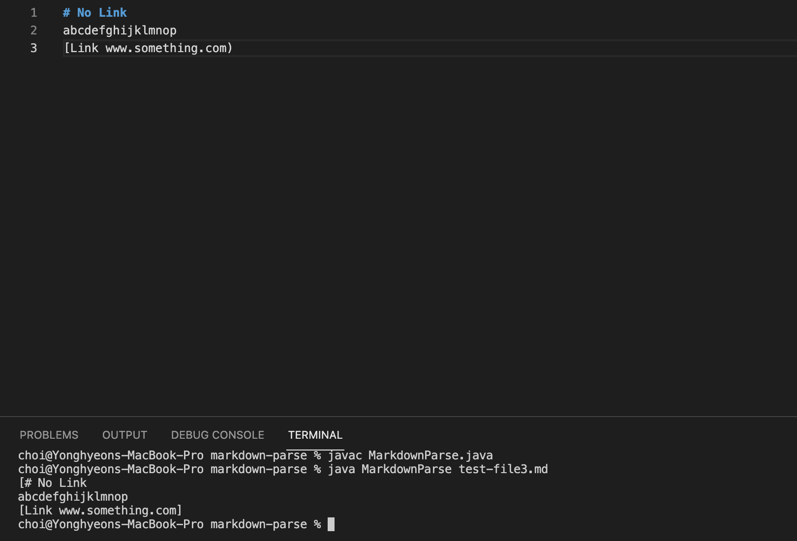
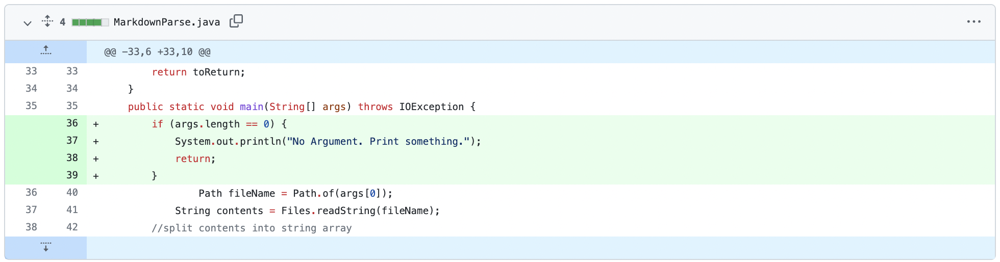
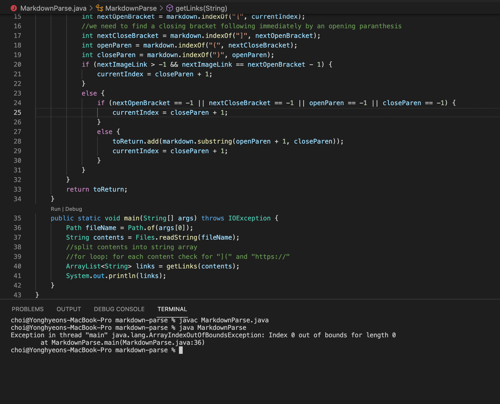

# Lab Report 2 - Week 4

# How to utilize debugging to fix a bug 
Yonghyeon Choi / PID : A17010613

# Code Change 1 : File including image link

## Code Change 

## Failure-Inducing Input File Link
- [Click](https://github.com/choi8616/markdown-parse/blob/main/test-file2.md)

## Failure-Inducing Input Symptom

> Relationship Description

- First bug was encounterd when `test-file2.md`, including image url, was used as an argument. It printed out the image url even though it wasn't a link. The bug 
  occured because `getLinks` method regarded the image url as a link also, since image url was also in the parentheses after brackets. To fix this bug, we tried to
  find a difference of property between a normal link and a image url. The difference was that image url included an exclamation mark before the brackets.
  Thus, we added a new `int` value that finds the index of the exclamation mark. Using this `int` value, we determined if the exclamation mark exists or not using   a `if-statement`. 
  

# Code Change 2 : File Without Link

## Code Change 

## Failure-Inducing Input File Link
- [Click](https://github.com/choi8616/markdown-parse/blob/main/test-file3.md)

## Failure-Inducing Input Symptom

> Relationship Description

- `test-file3.md` didn't include any proper form of link. Therefore, we expected the output to be an empty list. However, as shown in the symptom image, the output   printed all the texts in the file. To be a valid link, all of the parentheses(open and close) and brackets(open and close) should be included. To fix this bug,     we added an another `if-statement` that doesn't let `getLinks` method to add a link, which doesn't have all of the four components to be a valid link, to the 
  list.
  

# Code Change 3 : No Argument in Command

## Code Change

## Failure-Inducing Input File Link
- [Click](https://github.com/choi8616/markdown-parse/commit/d8d99b9d784319afff7d321e0fa8bb8331f6cb6d#)
- Third bug we encountered was error occuring when there is no command-line argument. In other words, there was no `.md` file to read. Thus, there is no link to the 
  test file. Instead, I included the link to the code before fixing lines.

## Failure-Inducing Input Symptom

> Relationship Description 

- This time, there was no argument in the command line. More specifically, after `%java MarkdownParse`, no test file was referenced. We received an           `ArrayIndexOutOfBoundsException` error message. This was caused because the main method was coded in a way presuming that there is always a command line in `args[0]`. To fix this, we added a new `if-statement` that checks if an argument is suggested by checking the length of `args`. 
