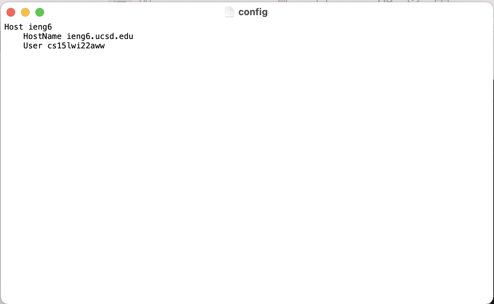
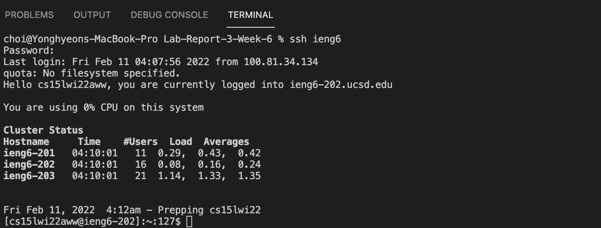
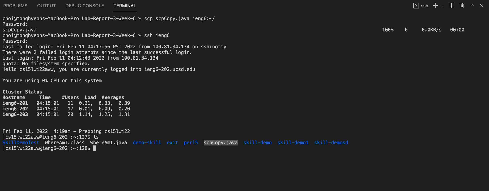

# Lab Report 3 - Week 6

Yonghyeon Choi / PID: A17010613

## Streaming `ssh` Configuration
My group decided to choose Option 1 - Streamline `ssh` Configuration 

## 1. `config` file

> Description 

- Screenshot below shows my `.ssh/config` file opened in my device. I opened it by using a command `open ~/.ssh/config`
- "Host ieng6" in the `config` file refers to an alias that will be used as a shorten command when logging into the server
- "HostName" refers to the host of the server, which I will be logging in
- "User" refers to my course specific account name
- Overall, this `config` file works as a tool that optimizes the process of typing in long commands to log into the server

## 2. `ssh` command using alias

> Description

- Screenshot below demonstrates the usage of the alias 
- Generally, we type in our course specific account name and host name to log in to the remote server (ex: `ssh cs15lwi22aww@ieng6.ucsd.edu`)
- However, by using `config` file, we can easily log in by simply typing in `ssh ieng6`

## 3. `scp` command using alias

> Description

- Screenshot below demonstrates the usage of the alias to copy a file to my account using the alias
- I created a example file `scpCopy.java` in my computer
- Instead of typing in long commands, I simply typed in `scp scpCopy.java ieng6:~/` to copy the file to the remote server
- By logging into the server and using `ls`, it is proved that `scpCopy.java` file is successfully copied into my account in the server

