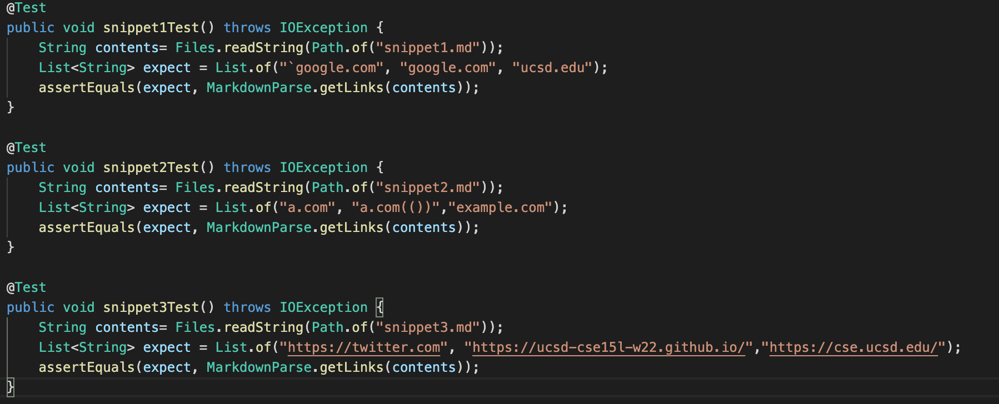

# Lab Report 4 - Week 8

Yonghyeon Choi / PID: A17010613

## Markdown Snippets
In this lab report, for three different given snippets, I tested both my implementation and 
other group's implementation of `markdown-parse`. I ran the test for each snippets and for each
implementations. In other words, I created total of 6 test methods. 

## My Implementation
[link to my implementation](https://github.com/choi8616/markdown-parse.git)

> Expected Outputs 

`Snippet1` : "`google.com", "google.com", "ucsd.edu"

`Snippet2` : "a.com", "a.com(())","example.com"

`Snippet3` : "https://twitter.com", "https://ucsd-cse15l-w22.github.io/","https://cse.ucsd.edu/"

## `Snippet 1`

Test Method

## `Snippet 2`

Test Method

## `Snippet 3`

Test Method

## Output for `Snippet 1,2,3`

Explanation : Test for `Snippet2` passed but test for `Snippet1` and `3` failed and the JUnit outputs 
for them are shown in the image.

## Implementation of other group that I reviewed 
[link to other implementation](https://github.com/Stocktocon/markdown-parse.git)

> Expected Outputs 

`Snippet1` : "`google.com", "google.com", "ucsd.edu"

`Snippet2` : "a.com", "a.com(())","example.com"

`Snippet3` : "https://twitter.com", "https://ucsd-cse15l-w22.github.io/","https://cse.ucsd.edu/"

## `Snippet 1,2,3` Test Methods

Explanation : Since the test methods are the same for this case and my implementation, I included
all three methods in one image. 

## Output for `Snippet 1,2,3` 

Explanation : All three tests for `Snippet 1,2,3` failed this time, and the Junit outputs for them
are shown in the image. 

## Questions 

- Do you think there is a small (<10 lines) code change that will make your program work for snippet 
1 and all related cases that use inline code with backticks? If yes, describe the code change. If not, 
describe why it would be a more involved change.

  For the first snippet, I saw that my code can't recognize the backticks in the code. Fix for this issue
  can be done with a small (<10 lines) code change. I will have to add codes that check the indexes of the 
  backticks. Utilizing those indexes variables, I can check what is within the two indexes of the backticks 
  and make sure that is ignored. In this case, the opening bracket should not be considered since it is 
  within the backticks. Through this fix, the proper links for the output will be guaranteed even with
  the backticks in the lines.

- Do you think there is a small (<10 lines) code change that will make your program work for snippet 2 
and all related cases that nest parentheses, brackets, and escaped brackets? If yes, describe the 
code change. If not, describe why it would be a more involved change.

  Fortunately, for the second snippet, my code passed. In my `MarkdownParse.java` file, I added a `while loop`
  with an `int` value that increases when it finds a open parantheses and decreases when it finds a close
  parantheses. When this count ever gets to 1, it escapes the `while loop` and outer parantheses are ignored
  and inner ones are considered. It is same for the brackets too. 

- Do you think there is a small (<10 lines) code change that will make your program work for snippet 3 
and all related cases that have newlines in brackets and parentheses? If yes, describe the code change. 
If not, describe why it would be a more involved change.

  For the third snippet, I think it will be way more complicated to fix the problems. It will be hard to 
  fix it with a small (<10 lines) code change. Currrently, my code uses `getLinks` method to check the 
  links according to each line. Therefore, I will have to use different codes rather than `getLinks` method
  to check the context. I might have to fix it by creating a method that keeps looking for parantheses and
  brackets even in a new line. Then, I will have to implement the codes that consider the links with those 
  information. Therefore, this will surely be a long and complicated code change. 
