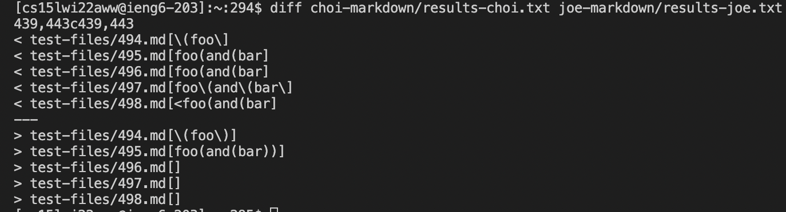
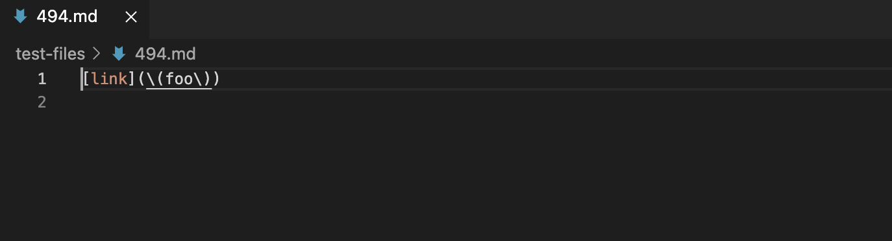
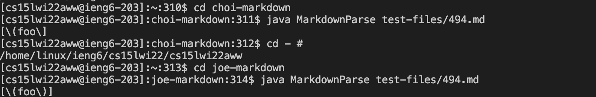
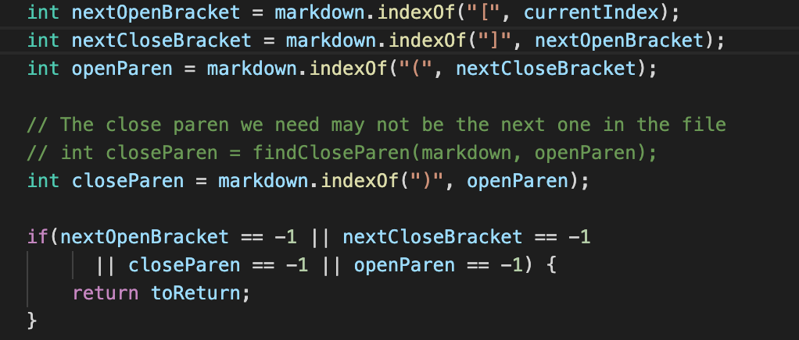
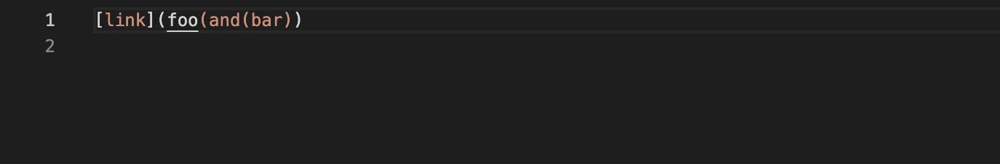
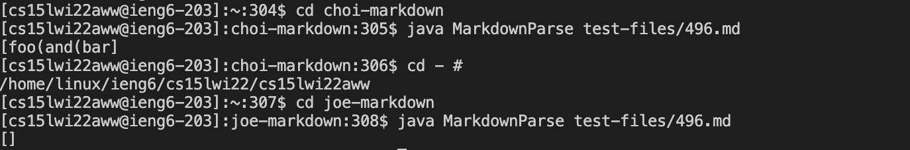
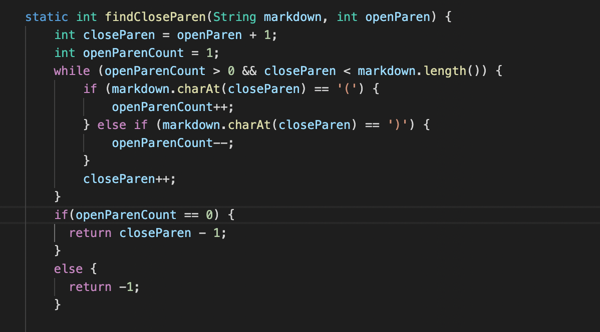
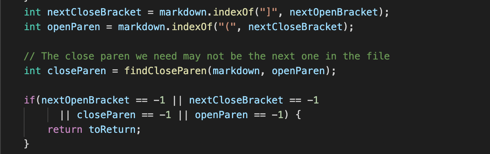

# Lab Report 5 - Week 10

Yonghyeon Choi / PID : A17010613

## Two MarkdownParse Comparison 
In this lab report, I tested 652 different `commonmark-spec` tests for two different `mark-down-parse` repository - my own implementation 
and implementation provided in lab 9. Then, using new commands learned during lab 9, I compared the outputs of those tests and found out 
the files that generate different outputs by each of two `mark-down-parse`. I chose two of them and found out what part of the coding 
leads to the incorrect outputs.

## How I found the test differences
To find the differences between the results for the tests, I first added the new `echo` commanmd in the provided `script.sh` file to 
easily distinguish which of the 652 files are having differences. Then, on `ieng6`, I copied the `test-files` folder and `script.sh` 
file from the repository provided in lab 9 to my own implementation. Then, I stored the results of the tests in each of the two text 
files - `result-choi.txt` and `results-joe.txt`. 
 

Then, I used `diff` command to get the outputs that were different between two sets of results. 

## Test 1 : File 494

First test that I chose was file 494. I double-checked the results by using general `java` commands too. My implementation gave the 
output of `[\(foo\]` and other one gave `[\(foo\)]`. Since the correct output should be `[(foo)]`, both results were wrong.

> Bug description

In my implementation, he bug in the code that caused the wrong result was the part where it finds the closing parantheses followed by the 
opening parantheses. As shown in the image above, my code simply finds the first closing parantheses after the opening parantheses but not 
the closing parantheses after the first one. Therefore, `[\(foo\]` is returned without any closing parantheses. It fails to recognize 
multiple closing parantheses thus ignore the closing parantheses that appear after the first one. 

> Possible way to fix the bug

To fix the bug, there should be a change between the lines intializing `openParen` and `closeParen` values. I would create an another 
separate method that finds if there are more closing parantheses even after the initial one. I would use `int` values and `for loop` 
to traverse through the texts to find the location of the last closing parantheses thus it can keep the critical closing parantheses. 
Utilizing this method, I the code would probably be able to take multilples of closing parantheses into account. 

## Test 2 : File 496

Second test that I chose was file 496, and again I double-checked. My implementation gave result of `[foo(and(bar]` and other
implementation gave `[]`. The exepcted output should be `[foo(and(bar)]`, again, both of the outputs were wrong. The reason of why 
my implementation was wrong was quite similar to the reason for previous debugging. Therefore, I chose to find the bug in other 
implementation. 

> Bug description

Looking at the codes, since it is generating an empty array, it menas that one of the values among `nextOpenBracket`, 
`nextCloseBracket`, `closeParen`, and `openParen` is -1, thus simply returning nothing. It is probably, between  `closeParen` or
`openParen` since there are multiple numbers of parantheses in the file. Therefore, I took a deeper look at the part where it finds
the positions of opening and closing parantheses.

> Possible way to fix the bug
In the method `findCloseParen` that is used to find the position of closing parantheses, it counts the numbers of opening parantheses.
Therefore, the value `openParenCount` is positive even though closed parentheses is found, leading that value to be still postivie 
even after `while loop`. Therefore, `return` value is -1, causing the `getLinks` method to simply return an empty array. Therefore, we
would have to fix the `if-statement` in the while loop that also takes multiple numbers of open parantheses into account so that it
doesn't affect searching for closing parantheses. Or, we can create a whole different method that also finds the open parantheses 
separately so that two methods together only search for necessary parantheses and keep the critical parantheses included in the link.

## Short Notes

I really want to thank you all of the tutors that helped us during the lab hours so that we can have better insight in coding and 
debugging. It has been a pleasure to learn different materials in this course and I am sure that they will greatly help me throughout
my coding career. 

Thanks to all!!

